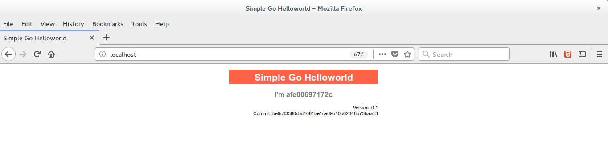

# Simple Go Helloworld
Simple Go helloworld is a web application written in Golang.
You could build and deploy the web application, on you Docker host, using the `make` utility as show below.

```shell
make
```

Once `make` finishes to run, the application will be accessible at http://localhost.


## Makefile targets
- **all**: builds the application and run it on Docker host. 
- **docker**: runs the application on Docker host.
- **build**: builds the application.
- **install**: installs the application and its dependencies.
- **clean**: cleans the binaries.
- **test**: runs defined test.
- **dep**: install dependency packages.
- **docker-image**: builds a docker image for the application.
- **docker-container**: creates a container and exposes it at Docker host.
- **docker-image-clean**: removes the image built for the applications.
- **docker-container-clean**: removes the containers created for the applications.

## Authors

Author:: Aleix Penella (aleix.penella [at] gmail.com)